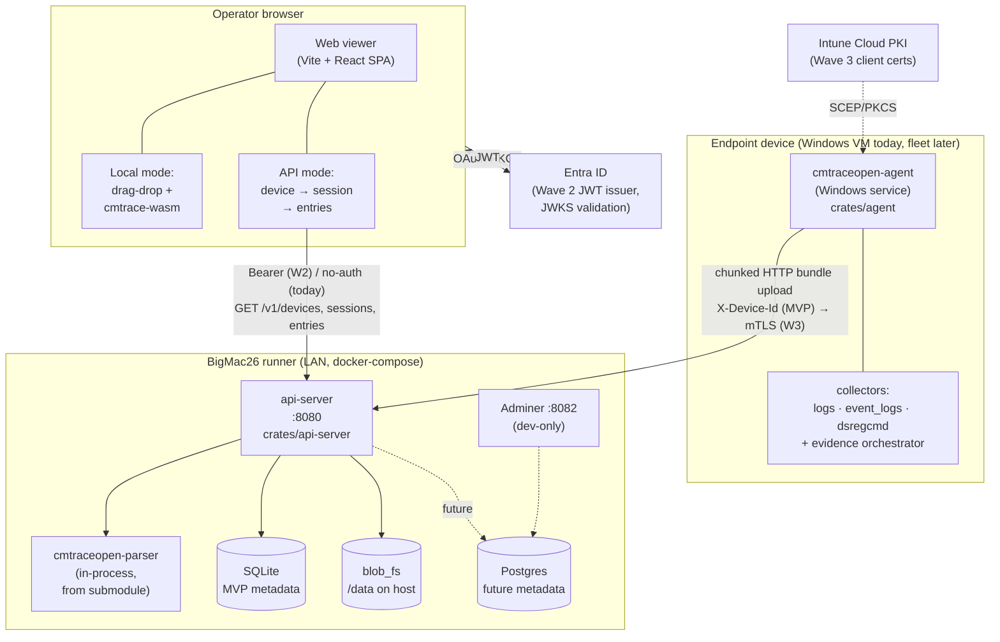

# cmtraceopen-web — Architecture Overview

Operator-facing map of the walking skeleton: who talks to what, where the
code lives, what moves over the wire, and how it deploys. For the
build-order narrative and AI-memory context see the Wave roadmap notes;
this doc is the tour you hand a new collaborator.

---

## 1. Component overview



<details>
<summary>ASCII fallback</summary>

```
  +-------------------------------------+         +---------------------+
  | Endpoint device (Windows)           |         | Entra ID            |
  |                                     |         |  (JWT issuer, W2)   |
  |  +-----------------------------+    |         +----------+----------+
  |  | cmtraceopen-agent           |    |                    |
  |  |  crates/agent               |    |                    | JWT
  |  |   +-----------------------+ |    |                    v
  |  |   | collectors:           | |    |         +---------------------+
  |  |   |  logs/event_logs/     | |    |         | Operator browser    |
  |  |   |  dsregcmd + evidence  | |    |         |  Vite + React SPA   |
  |  |   +-----------------------+ |    |         |  - Local (WASM)     |
  |  +-----------+-----------------+    |         |  - API mode         |
  |              |                      |         +----------+----------+
  +--------------|----------------------+                    |
                 |                                           |
      chunked HTTP bundle upload            GET /v1/devices, sessions, entries
      X-Device-Id (MVP)                     Bearer (W2) / no-auth today
      -> mTLS (Wave 3 via Cloud PKI)                        |
                 |                                          |
                 v                                          v
  +------------------------------------------------------------------+
  | BigMac26 runner (docker-compose on Colima, LAN @ 192.168.2.50)   |
  |                                                                  |
  |   +------------------+          +---------------------------+    |
  |   | api-server :8080 |--parse-->| cmtraceopen-parser        |    |
  |   | crates/api-server|          | (submodule, in-process)   |    |
  |   +--------+---------+          +---------------------------+    |
  |            |                                                     |
  |            +--> SQLite (MVP metadata)                             |
  |            +--> blob_fs /data                                    |
  |            +-.-> Postgres (future) <--- Adminer :8082 (dev UI)   |
  +------------------------------------------------------------------+

  Intune Cloud PKI (Wave 3) -.SCEP.-> Agent (client cert for mTLS)
```
</details>

---

## 2. Repo layout + crate map

```
cmtraceopen-web/
├── Cargo.toml                      Rust workspace (excludes cmtrace-wasm)
├── crates/
│   ├── api-server/                 axum :8080, ingest + query routes
│   │   ├── src/routes/             ingest · devices · sessions · files · entries · health · status
│   │   ├── src/pipeline/           parse-on-ingest worker
│   │   ├── src/storage/            blob_fs + meta_sqlite
│   │   └── migrations/             0001_initial.sql, 0002_entries.sql
│   ├── common-wire/                shared DTOs (serde camelCase)
│   └── agent/                      Windows-service scaffold + collectors
├── cmtrace-wasm/                   separate workspace, wasm-bindgen cdylib
│   └── (path-deps cmtraceopen-parser for browser-side Local mode)
├── cmtraceopen/                    git submodule — the Tauri app repo
│   └── crates/cmtraceopen-parser   pure-Rust parser consumed by both
│                                   api-server (native) and cmtrace-wasm
├── src/                            viewer SPA (Vite + React + TypeScript)
│   ├── components/                 ViewerShell · LocalMode · ApiMode · DropZone · EntryList
│   └── lib/                        api-client.ts · wasm-bridge.ts · log-types.ts
├── tools/                          ship-bundle.sh · query.sh · fixtures/
├── docs/provisioning/              01 VM · 02 Entra app · 03 Intune PKI
├── dev/bigmac-runner-kit/          Ansible deploy kit for the lab host
├── docker-compose.yml              api-server + Postgres + Adminer
└── scripts/                        build + ops helpers
```

`cmtraceopen-parser` is the only piece of code pulled across the
repo boundary — api-server depends on it via path
(`../../cmtraceopen/crates/cmtraceopen-parser`), and `cmtrace-wasm`
re-exports it through `wasm-bindgen`. One parser, two call sites: in
the server on ingest, in the browser for offline drag-drop.

---

## 3. Bundle wire format

An evidence bundle is a plain zip. Shape:

```
bundle-{uuid}.zip
├── manifest.json             schemaVersion, collectedUtc, agent, device, artifacts[]
├── evidence/
│   ├── logs/*.log            CMTrace / CCM text logs
│   ├── event-logs/*.evtx     Windows Event Log exports
│   └── command-output/
│       └── dsregcmd-status.txt
└── analysis-input/           (optional) pre-parsed NDJSON from native readers
```

Canonical smallest example: `tools/fixtures/test-bundle.zip`, rebuilt
deterministically by `bash tools/fixtures/build.sh` (zip -X, pinned
mtimes, sorted file order). Manifest schema is mirrored in
`common-wire::ingest::content_kind`:

- `evidence-zip` — the full zip above
- `ndjson-entries` — one `LogEntry` per line
- `raw-file` — single log file, no zip

---

## 4. Ingest + query protocol

**Ingest** (resumable chunked upload, idempotent on `bundleId`):

| Method | Path | What it does | Success |
|---|---|---|---|
| `POST` | `/v1/ingest/bundles` | init; echoes `uploadId`, server chunk size, `resumeOffset` | `201` new · `200` resume / already-done |
| `PUT`  | `/v1/ingest/bundles/{upload_id}/chunks?offset=N` | append chunk at `offset` | `200` with `nextOffset` |
| `POST` | `/v1/ingest/bundles/{upload_id}/finalize` | verify sha256, commit session, kick parse worker | `201` new · `200` resumed-to-done |

Errors: `400` bad sha/size/kind · `409` bundleId reused with mismatched
sha/size/kind · `413` chunk over `MAX_CHUNK_SIZE`. Device identity is
`X-Device-Id` in MVP; switches to cert SAN URI
`device://{tenant}/{aad-device-id}` once mTLS lands — see
[`docs/provisioning/03-intune-cloud-pki.md`](./provisioning/03-intune-cloud-pki.md).

**Query** (keyset-paginated, opaque base64 cursor):

| Method | Path | Purpose |
|---|---|---|
| `GET` | `/v1/devices` | list devices (summary + session counts) |
| `GET` | `/v1/devices/{device_id}/sessions` | sessions for a device |
| `GET` | `/v1/sessions/{session_id}` | one session |
| `GET` | `/v1/sessions/{session_id}/files` | files emitted by the parser |
| `GET` | `/v1/sessions/{session_id}/entries` | entries, filterable by `file`/`severity`/`after_ts`/`before_ts`/`q` |
| `GET` | `/healthz` · `/readyz` · `/` | liveness · readiness · dev status page |
| `GET` | `/metrics` | Prometheus text-exposition snapshot (no auth — see below) |

All pagination responses: `{ items, nextCursor }`. Default limit 50–200,
cap 500. Reference client: `tools/ship-bundle.sh` + `tools/query.sh`
(see [`tools/README.md`](../tools/README.md)).

### Observability — `/metrics`

The api-server exposes a Prometheus 0.0.4 text-exposition endpoint at
`GET /metrics`, backed by the `metrics` + `metrics-exporter-prometheus`
crates (the modern metrics-rs ecosystem; we deliberately avoid the older
`prometheus = "0.13"` crate and its hyper-tied scrape server). Recommended
scrape interval: **15s** (Prometheus default); a `scrape_configs` block
pointing at `<host>:8080/metrics` is all that's needed.

`/metrics` is **unauthenticated** — Prometheus scrapers don't speak Bearer
tokens by default, and the operator-bearer auth on this server is geared at
human-driven JSON queries. In production, lock it down at the network layer
(firewall / NetworkPolicy to the Prometheus pod only) or expose it on a
separate listener bound to a private interface. Liveness / readiness probes
keep their own routes (`/healthz`, `/readyz`) so probe latency doesn't drift
as more metrics are added.

Initial metric set:

| Metric | Type | Labels | Meaning |
|---|---|---|---|
| `cmtrace_http_requests_total` | counter | `path` (matched route template) | Every served HTTP request |
| `cmtrace_http_request_duration_seconds` | histogram | `path` | End-to-end handler latency |
| `cmtrace_ingest_bundles_initiated_total` | counter | — | Accepted ingest /init requests |
| `cmtrace_ingest_bundles_finalized_total` | counter | `status=ok\|partial\|failed` | Finalize-attempt outcomes |
| `cmtrace_ingest_chunks_received_total` | counter | — | Chunks successfully appended |
| `cmtrace_parse_worker_runs_total` | counter | `result=ok\|partial\|failed` | Background parse-worker runs |
| `cmtrace_parse_worker_duration_seconds` | histogram | — | Parse-worker wall-clock time |
| `cmtrace_db_connections_in_use` | gauge | — | sqlx pool: `size - idle` |

Path labels come from Axum's `MatchedPath` extractor (e.g.
`/v1/devices/{device_id}/sessions`), so the `path` cardinality is bounded
by the route table — adding a new route adds one label value, not one per
device.

---

## 5. Deployment topology

- **Dev (solo laptop)** — `docker compose up` brings api-server +
  Postgres + Adminer. Viewer runs off Vite at `localhost:5173`, calls
  `localhost:8080` via proxy / CORS. SQLite lives in the `api-data`
  volume; Postgres is wired but unused by the MVP.
- **Lab (BigMac26)** — same compose stack on Colima (native arm64),
  reachable from the LAN at `192.168.2.50:8080`. Windows VMs on the same
  segment ship bundles against that endpoint. Deploy via the Ansible
  kit under `dev/bigmac-runner-kit/`.
- **Production (future)** — api-server image from GHCR on a Linux host
  (Azure VM or AKS). Metadata in managed Postgres. Blobs in Azure Blob
  Storage. Agents authenticate via mTLS using Intune-Cloud-PKI-issued
  client certs; operators authenticate via Entra OAuth and present
  Bearer JWTs to the api-server, validated against the tenant's JWKS.

Adminer and the Postgres host port are **dev-only** — no auth, wide-open
SQL console. Firewall off or drop from compose before shipping.

---

## 6. State of the platform (today)

Waves 0 – 1 shipped: workspace scaffold, common-wire DTOs, api-server
walking skeleton (ingest v0, parse-on-ingest, entries query, dev status
page), reference ingest client + fixture, BigMac compose deploy, Vite +
React viewer with Local (WASM) and API fetch modes, Adminer on :8082.
Wave 2 is in flight: real agent collectors (`feat/agent-m1-collectors`),
Entra operator Bearer auth (`feat/api-operator-bearer-auth`), CORS
(`feat/api-cors`), viewer UX polish (`feat/viewer-ux-v1`). Wave 3 —
Intune Cloud PKI issuance, api-server mTLS termination, Postgres +
Azure Blob migration — is documented but not implemented. Runbook for
the Wave 3 PKI prerequisite is at
[`docs/provisioning/03-intune-cloud-pki.md`](./provisioning/03-intune-cloud-pki.md).
